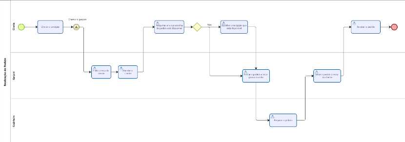

## 3. Modelagem dos Processos de Negócio

### 3.1. Modelagem da situação atual (Modelagem AS IS)

A modelagem AS-IS do FastBurger descreve os processos manuais e ineficientes de uma hamburgueria típica antes da implementação do sistema proposto.  A falta de integração entre as diferentes etapas gera atrasos, erros e frustrações para clientes e funcionários.

**Processo AS-IS: Realização de Pedido:**

1. **Cliente escolhe o pedido:** O cliente analisa o cardápio físico e comunica seu pedido a um garçom.
2. **Garçom anota o pedido:** O garçom anota o pedido manualmente em um bloco de notas ou sistema rudimentar.  Possíveis erros de interpretação ou escrita são comuns nessa etapa.
3. **Garçom envia o pedido à cozinha:** O garçom leva o pedido para a cozinha, onde pode haver atrasos ou perda do pedido.
4. **Cozinheiro prepara o pedido:** O cozinheiro prepara o pedido baseado na anotação do garçom.  Possíveis erros na preparação podem ocorrer devido à ilegibilidade da escrita.
5. **Garçom entrega o pedido:** O garçom entrega o pedido ao cliente, podendo haver atrasos dependendo da lotação do restaurante.
6. **Cliente paga o pedido:** O cliente paga o pedido ao garçom, sendo necessário lidar com dinheiro e/ou máquina de cartão.
7. **Garçom fecha a conta:** O garçom fecha a conta manualmente e pode ocorrer erros de cálculo.

**Processo AS-IS: Gestão de Estoque:**

1. **Verificação visual:** O cozinheiro verifica visualmente a quantidade de ingredientes disponíveis no estoque.  Não há um controle preciso das quantidades.
2. **Comunicação informal:** Quando algum ingrediente está acabando, o cozinheiro comunica informalmente ao gerente ou responsável pela compra.
3. **Pedido de compras:** O gerente realiza o pedido de compras de forma manual e imprecisa, baseado na comunicação informal.  Pode haver atrasos na entrega de insumos.

**Processo AS-IS: Gestão de Cardápios:**

1. **Atualizações manuais:**  Mudanças no cardápio são feitas manualmente, envolvendo impressão de novos cardápios e substituição dos antigos.  Há alto risco de inconsistências entre os cardápios impressos e os disponíveis para os garçons.

*(Diagramas BPMN AS-IS seriam inseridos aqui para cada processo descrito acima, mostrando visualmente o fluxo de trabalho atual.)*

### 3.2. Descrição geral da proposta (Modelagem TO BE)

A proposta de solução FastBurger visa integrar os processos através de uma plataforma digital, eliminando as ineficiências dos processos manuais. O sistema proposto busca otimizar as etapas através da automação, reduzindo erros, melhorando a comunicação e fornecendo informações em tempo real para todos os envolvidos.

**Limites da solução:** A solução considera o uso de uma aplicação web, o que implica na dependência de acesso à internet.  A integração com sistemas externos de delivery (como iFood ou Uber Eats)  está prevista para futuras atualizações. A segurança da informação,  a escalabilidade do sistema e a  manutenção contínua são pontos cruciais que devem ser considerados.

**Alinhamento com os objetivos:** A solução FastBurger está totalmente alinhada com os objetivos de melhoria da eficiência operacional e da experiência do cliente. A automação dos processos reduz erros, otimiza o tempo de atendimento e garante informações precisas, resultando em melhor satisfação do cliente e maior rentabilidade do negócio.

**Oportunidades de Melhoria:**

* **Redução de erros:** A automação diminui erros humanos na anotação de pedidos e cálculo de valores.
* **Aumento da eficiência:** A digitalização agiliza o processo de pedidos, pagamentos e gestão de estoque.
* **Melhora na comunicação:** A integração do sistema garante uma comunicação eficiente entre clientes, garçons, cozinha e gerência.
* **Tomada de decisão:** Relatórios de vendas e controle de estoque facilitam a tomada de decisões estratégicas.
* **Melhor experiência do cliente:** Pedido online mais rápido e prático.

**Realização de pedido**

**Gestão de Pagamentos**

**Gestão de Cardápios**

**Controle de Estoque de Insumos**

### 3.3. Modelagem dos processos

[PROCESSO 1 - Realização de Pedido](./processos/processo-1-realizacao-pedido.md "Detalhamento do Processo de Realização de Pedido.")

[PROCESSO 2 - Gestão de Estoque](./processos/processo-2-gestao-estoque.md "Detalhamento do Processo de Gestão de Estoque.")

[PROCESSO 3 - Gestão de Cardápios](./processos/processo-3-gestao-cardapios.md "Detalhamento do Processo de Gestão de Cardápios.")

[PROCESSO 4 - Gestão de Pagamentos](./processos/processo-4-gestao-pagamentos.md "Detalhamento do Processo de Gestão de Pagamentos.")

*(Os links acima levariam para documentos markdown detalhando cada processo com os diagramas BPMN AS-IS e TO-BE.)*
