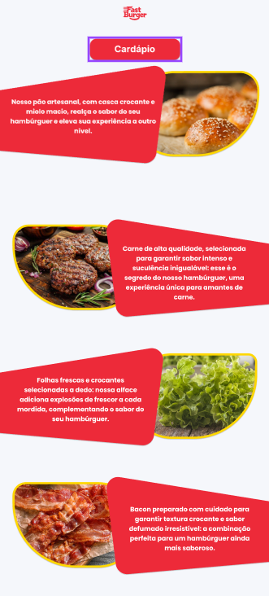
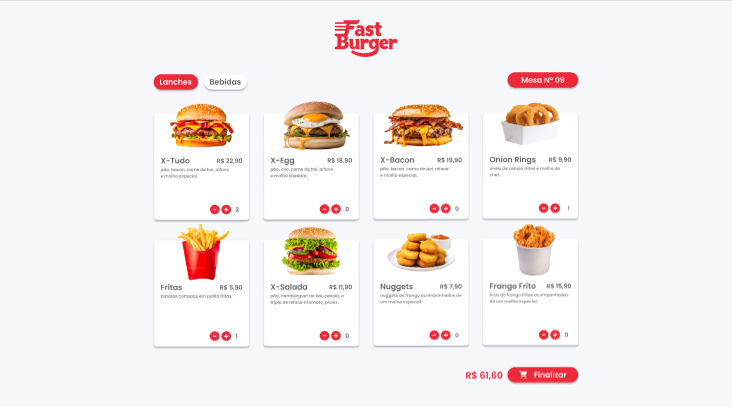
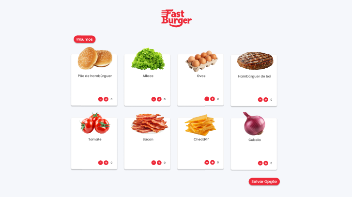
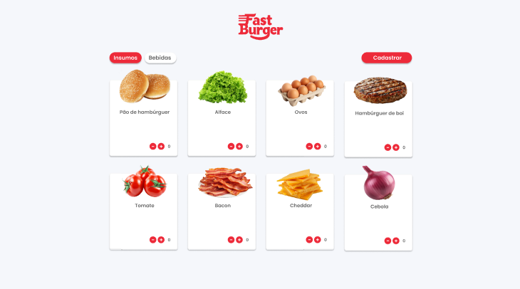
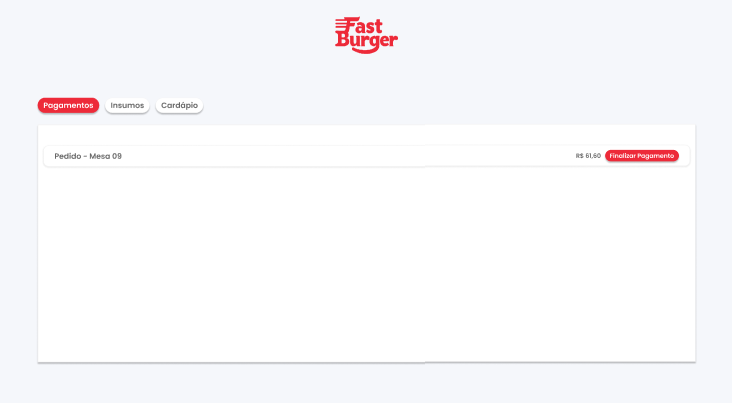

## 4. Projeto da Solução

Pré-requisitos: <a href="3-Modelagem-do-Processo-de-Negocio.md"> Modelagem do Processo de Negocio</a>

## 4.1. Arquitetura da solução

......  COLOQUE AQUI O SEU TEXTO E O DIAGRAMA DE ARQUITETURA .......

 Inclua um diagrama da solução e descreva os módulos e as tecnologias
 que fazem parte da solução. Discorra sobre o diagrama.
 
 **Exemplo do diagrama de Arquitetura**:
 
 
 

### 4.2. Protótipos de telas

> #### 1. **Tela Inicial - Cardápio de Produtos**
> **Imagem:** 
>
> **Descrição:**
> > - Esta é a tela principal e inicial da aplicação, onde o usuário visualiza o **cardápio de lanches e bebidas** disponíveis.
> > - Apresenta os produtos de forma organizada, cada um com:
> >     > - Uma imagem ilustrativa do produto.
> >     > - O nome do produto (ex: "X-Tudo", "X-Egg", "Onion Rings").
> >     > - O preço do produto (ex: "R$ 22,90").
> >     > - Uma descrição breve do produto.
> >     > - Um contador de quantidade com botões "+" e "-" para adicionar ou remover itens do pedido.
> > - Há abas para alternar entre "Lanches" e "Bebidas".
> > - Na parte inferior da tela, há:
> >     > - O valor total do pedido atualizado em tempo real.
> >     > - Um botão "Finalizar" para prosseguir com o pedido.
> >     > - Uma indicação do número da mesa atual ("Mesa N° 09").
>
> **Requisitos Atendidos:**
> > - **Funcional:** Exibir a lista completa de produtos (lanches e bebidas).
> > - **Funcional:** Permitir ao usuário adicionar ou remover produtos do pedido.
> > - **Funcional:** Exibir o preço de cada produto e o valor total do pedido atualizado dinamicamente.
> > - **Funcional:** Permitir alternar entre categorias de produtos (lanches e bebidas).
> > - **Funcional:** Iniciar o processo de finalização do pedido.
> > - **Funcional:** Exibir número da mesa associada ao pedido.
> > - **Não Funcional:** Interface atraente, organizada e intuitiva para facilitar a navegação do usuário.
> > - **Não Funcional:** Layout responsivo, adaptável a diferentes tamanhos de tela.
> > - **Não Funcional:** Tempo de carregamento rápido e performance eficiente.
>
> **Fluxo da Tela:**
> > - O usuário inicia na tela, visualiza o cardápio, seleciona os produtos desejados e suas quantidades, visualiza o preço total e clica em "Finalizar" para avançar no processo.
>
> **Interações:**
> > - Os usuários podem interagir com os botões "+" e "-" para ajustar a quantidade dos itens, as abas de categoria (lanches e bebidas), e o botão "Finalizar".
>
> ---
>
> #### 2. **Tela Inicial - Cardápio de Produtos**
> **Imagem:** 
>
> **Descrição:**
> > - Tela inicial da aplicação, mostrando os **lanches e acompanhamentos** disponíveis.
> > - Cada produto é exibido em um cartão com:
> >     > - Nome do produto (ex: X-Tudo, X-Egg)
> >     > - Preço (ex: R$ 22,90)
> >     > - Descrição resumida
> >     > - Contador de quantidade com botões **+** e **-**
> > - Aba "Lanches" e "Bebidas" para navegação.
> > - Total do pedido e botão "Finalizar".
>
> **Requisitos Atendidos:**
> > - **Funcional:** Exibir lista de produtos com opções de seleção.
> > - **Funcional:** Atualização dinâmica do preço total e do número de itens no carrinho.
> > - **Funcional:** Navegação por abas entre diferentes categorias de produtos.
> > - **Não Funcional:** Layout intuitivo, atraente e fácil de usar.
>
> ---
>
> #### 3. **Tela de Personalização - Criar Opções (Ingredientes)**
> **Imagem:** 
>
> **Descrição:**
> > - Permite ao usuário **personalizar o lanche** selecionando os ingredientes.
> > - Apresenta:
> >     > - Imagem do ingrediente
> >     > - Nome do ingrediente (Pão de hambúrguer, alface, ovo, etc.)
> >     > - Contador de quantidade com botões **+** e **-**
> > - Botão "Salvar Opção".
> > - Aba "Insumos" e "Bebidas" para navegação.
>
> **Requisitos Atendidos:**
> > - **Funcional:** Permitir a escolha de ingredientes para customizar o pedido.
> > - **Funcional:** Atualizar a quantidade de cada ingrediente selecionado.
> > - **Funcional:** Salvar as preferências de customização do lanche.
> > - **Não Funcional:** Interface clara e fácil de entender para o usuário.
>
> ---
>
> #### 4. **Tela de Cadastro/Insumos (Gerenciamento)**
> **Imagem:** 
>
> **Descrição:**
> > - Interface para **gerenciamento dos insumos** ou ingredientes disponíveis no sistema.
> > - Apresenta os ingredientes:
> >     > - Imagem do ingrediente
> >     > - Nome do ingrediente
> >     > - Controles de quantidade com botões **+** e **-**
> > - Abas "Insumos" e "Bebidas" para navegação.
> > - Botão "Cadastrar".
>
> **Requisitos Atendidos:**
> > - **Funcional:** Permitir a gestão do estoque de ingredientes.
> > - **Funcional:** Permitir adicionar/remover itens do estoque.
> > - **Funcional:** Categorizar ingredientes por abas.
> > - **Não Funcional:** Interface organizada e fácil de usar para o gerenciamento.
>
> ---
>
> #### 5. **Tela de Pedido - Insumos (Seleção de Ingredientes)**
> **Imagem:** 
>
> **Descrição:**
> > - Permite a seleção de ingredientes para um pedido ou personalização.
> > - Apresenta:
> >     > - Imagem do ingrediente
> >     > - Nome do ingrediente
> >     > - Controles de quantidade com botões **+** e **-**
> > - Botão "Salvar Opção".
>
> **Requisitos Atendidos:**
> > - **Funcional:** Permitir que o usuário selecione ingredientes para um pedido específico.
> > - **Funcional:** Atualizar a quantidade de cada ingrediente selecionado.
> > - **Funcional:** Salvar a configuração de ingredientes do pedido.
> > - **Não Funcional:** Interface focada na seleção e configuração do pedido.
>
> ---
>
> #### 6. **Tela de Pagamento**
> **Imagem:** 
>
> **Descrição:**
> > - Exibe informações sobre o pedido e o valor total para o **pagamento**.
> > - Mostra:
> >     > - Número do pedido ou mesa (ex: Pedido - Mesa 09)
> >     > - Valor total (ex: R$ 61,60)
> > - Botão "Finalizar Pagamento".
> > - Menu de navegação com as abas "Pagamentos", "Insumos" e "Cardápio".
>
> **Requisitos Atendidos:**
> > - **Funcional:** Exibir detalhes do pedido e valor total.
> > - **Funcional:** Iniciar o processo de finalização do pagamento.
> > - **Funcional:** Navegação por abas entre diferentes seções da aplicação.
> > - **Não Funcional:** Layout limpo e informativo.
>
> ---
>
> ### Organização Geral e Navegação
>
> > - **Navegação Intuitiva:** As telas são projetadas para facilitar a navegação entre elas.
> > - **Fluxo Lógico:** O usuário segue um fluxo sequencial: cardápio, customização, resumo e pagamento.
> > - **Botões e Menus:** Uso de botões como "Finalizar", "Salvar Opção" e menu de abas.
>
> ---
## Diagrama de Classes

O diagrama de classes ilustra graficamente como será a estrutura do software, e como cada uma das classes da sua estrutura estarão interligadas. Essas classes servem de modelo para materializar os objetos que executarão na memória.

As referências abaixo irão auxiliá-lo na geração do artefato “Diagrama de Classes”.

> - [Diagramas de Classes - Documentação da IBM](https://www.ibm.com/docs/pt-br/rational-soft-arch/9.6.1?topic=diagrams-class)
> - [O que é um diagrama de classe UML? | Lucidchart](https://www.lucidchart.com/pages/pt/o-que-e-diagrama-de-classe-uml)

## Modelo ER

O Modelo ER representa através de um diagrama como as entidades (coisas, objetos) se relacionam entre si na aplicação interativa.]

As referências abaixo irão auxiliá-lo na geração do artefato “Modelo ER”.

> - [Como fazer um diagrama entidade relacionamento | Lucidchart](https://www.lucidchart.com/pages/pt/como-fazer-um-diagrama-entidade-relacionamento)

### 4.3. Modelo de dados

O desenvolvimento da solução proposta requer a existência de bases de dados que permitam efetuar os cadastros de dados e controles associados aos processos identificados, assim como recuperações.
Utilizando a notação do DER (Diagrama Entidade e Relacionamento), elaborem um modelo, na ferramenta visual indicada na disciplina, que contemple todas as entidades e atributos associados às atividades dos processos identificados. Deve ser gerado um único DER que suporte todos os processos escolhidos, visando, assim, uma base de dados integrada. O modelo deve contemplar, também, o controle de acesso de usuários (partes interessadas dos processos) de acordo com os papéis definidos nos modelos do processo de negócio.
_Apresente o modelo de dados por meio de um modelo relacional que contemple todos os conceitos e atributos apresentados na modelagem dos processos._

#### 4.3.1 Modelo ER

O Modelo ER representa através de um diagrama como as entidades (coisas, objetos) se relacionam entre si na aplicação interativa.]

As referências abaixo irão auxiliá-lo na geração do artefato “Modelo ER”.

> - [Como fazer um diagrama entidade relacionamento | Lucidchart](https://www.lucidchart.com/pages/pt/como-fazer-um-diagrama-entidade-relacionamento)

#### 4.3.2 Esquema Relacional

O Esquema Relacional corresponde à representação dos dados em tabelas juntamente com as restrições de integridade e chave primária.
 
As referências abaixo irão auxiliá-lo na geração do artefato “Esquema Relacional”.

> - [Criando um modelo relacional - Documentação da IBM](https://www.ibm.com/docs/pt-br/cognos-analytics/10.2.2?topic=designer-creating-relational-model)

---

#### 4.3.3 Modelo Físico

Insira aqui o script de criação das tabelas do banco de dados.

Veja um exemplo:

<code>

 -- Criação da tabela Médico
CREATE TABLE Medico (
    MedCodigo INTEGER PRIMARY KEY,
    MedNome VARCHAR(100)
);

-- Criação da tabela Paciente
CREATE TABLE Paciente (
    PacCodigo INTEGER PRIMARY KEY,
    PacNome VARCHAR(100)
);

-- Criação da tabela Consulta
CREATE TABLE Consulta (
    ConCodigo INTEGER PRIMARY KEY,
    MedCodigo INTEGER,
    PacCodigo INTEGER,
    Data DATE,
    FOREIGN KEY (MedCodigo) REFERENCES Medico(MedCodigo),
    FOREIGN KEY (PacCodigo) REFERENCES Paciente(PacCodigo)
);

-- Criação da tabela Medicamento
CREATE TABLE Medicamento (
    MdcCodigo INTEGER PRIMARY KEY,
    MdcNome VARCHAR(100)
);

-- Criação da tabela Prescricao
CREATE TABLE Prescricao (
    ConCodigo INTEGER,
    MdcCodigo INTEGER,
    Posologia VARCHAR(200),
    PRIMARY KEY (ConCodigo, MdcCodigo),
    FOREIGN KEY (ConCodigo) REFERENCES Consulta(ConCodigo),
    FOREIGN KEY (MdcCodigo) REFERENCES Medicamento(MdcCodigo)
);

</code>

Este script deverá ser incluído em um arquivo .sql na pasta src\bd.

### 4.4. Tecnologias

_Descreva qual(is) tecnologias você vai usar para resolver o seu problema, ou seja, implementar a sua solução. Liste todas as tecnologias envolvidas, linguagens a serem utilizadas, serviços web, frameworks, bibliotecas, IDEs de desenvolvimento, e ferramentas._

Apresente também uma figura explicando como as tecnologias estão relacionadas ou como uma interação do usuário com o sistema vai ser conduzida, por onde ela passa até retornar uma resposta ao usuário.

| **Dimensão**   | **Tecnologia**  |
| ---            | ---             |
| SGBD           | MySQL           |
| Front end      | HTML+CSS+JS     |
| Back end       | Java SpringBoot |
| Deploy         | Github Pages    |
