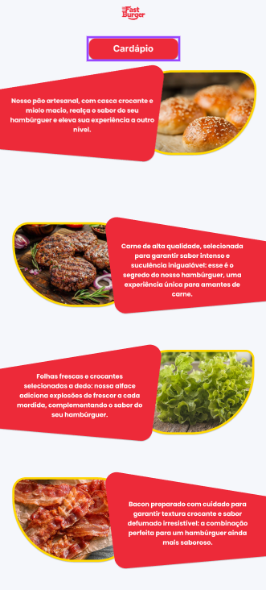
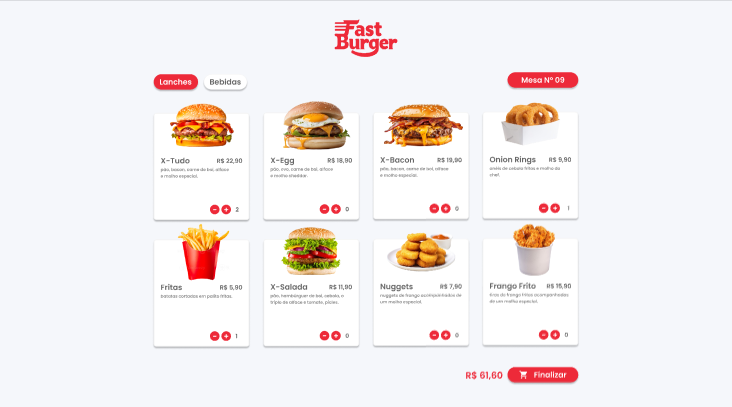
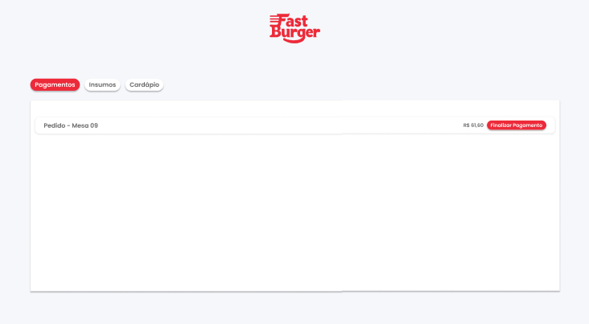
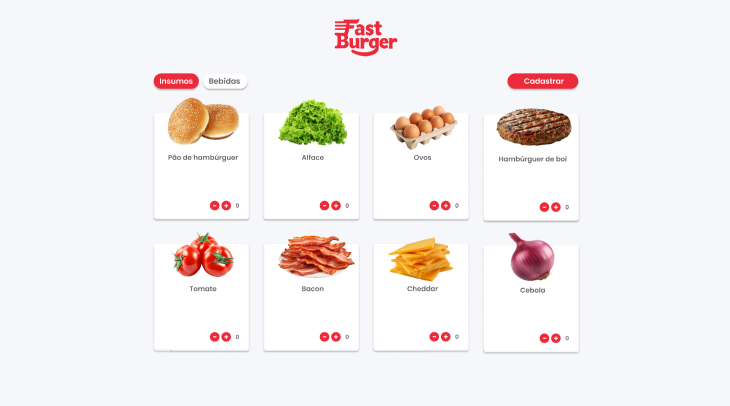
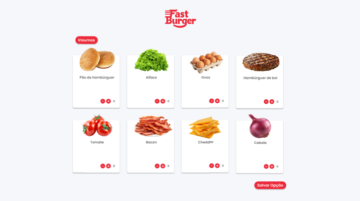

# 6. Interface do Sistema

**Pré-requisitos:** [Projeto da Solução](4-Projeto-Solucao.md)

Esta seção descreve a interface do usuário (UI) do sistema FastBurger, fornecendo uma visão geral da interação do usuário através das principais telas.  As imagens reais substituirão os placeholders `[`Tela principal do sistema`](images/)` e similares.

## 6.1. Tela Principal do Sistema

A tela principal do sistema FastBurger apresenta uma interface limpa e intuitiva, projetada para uma fácil navegação.  Ela inclui:

* **Cabeçalho:**  Contém o logotipo do FastBurger e um menu de navegação principal com opções para: Cardápio, Pedidos (somente para clientes), Estoque (somente para gerentes), Relatórios (somente para gerentes) e Sair.
* **Conteúdo Principal:**  Esta área varia dependendo do tipo de usuário. **...**
* **Rodapé:**  Contém informações de contato e copyright.

[`Tela principal do sistema`]

## 6.2. Telas do Processo de Realização de Pedido (Cliente)

**6.2.1. Tela de Cardápio:**

Esta tela apresenta o cardápio de forma organizada por categorias (Hambúrgueres, Bebidas, Acompanhamentos). Cada item do cardápio exibe uma imagem, o nome, a descrição e o preço.  Botões "+" e "-" permitem ajustar a quantidade desejada de cada item. Um botão "Adicionar ao Pedido" adiciona o item ao carrinho.

[`Tela do Cardápio`]

**6.2.2. Tela de Pagamento:**

Oferece opções de pagamento (cartão de crédito/débito ou dinheiro).  No caso de pagamento com cartão, integra-se com uma gateway de pagamento (exemplo: Stripe ou PagSeguro).  Após o pagamento, exibe uma mensagem de confirmação do pedido.

[`Tela de Pagamento`]

## 6.3. Telas do Processo de Gestão de Estoque (Gerente)

**6.3.1. Tela de Estoque:**

Apresenta uma lista de todos os insumos em estoque, com seus respectivos nomes, quantidades e um campo para solicitar reposição.  Permite pesquisar por insumo e filtrar os resultados.

[`Tela de Estoque`]

**6.3.2. Tela de Criação de Produtos:**

Apresenta uma interface para a criação de novos produtos (como hambúrgueres). Permite selecionar os insumos desejados, definir as quantidades de cada um e nomear o produto. Inclui um botão para salvar as opções selecionadas.

[`Tela de Criação de Produtos`]
